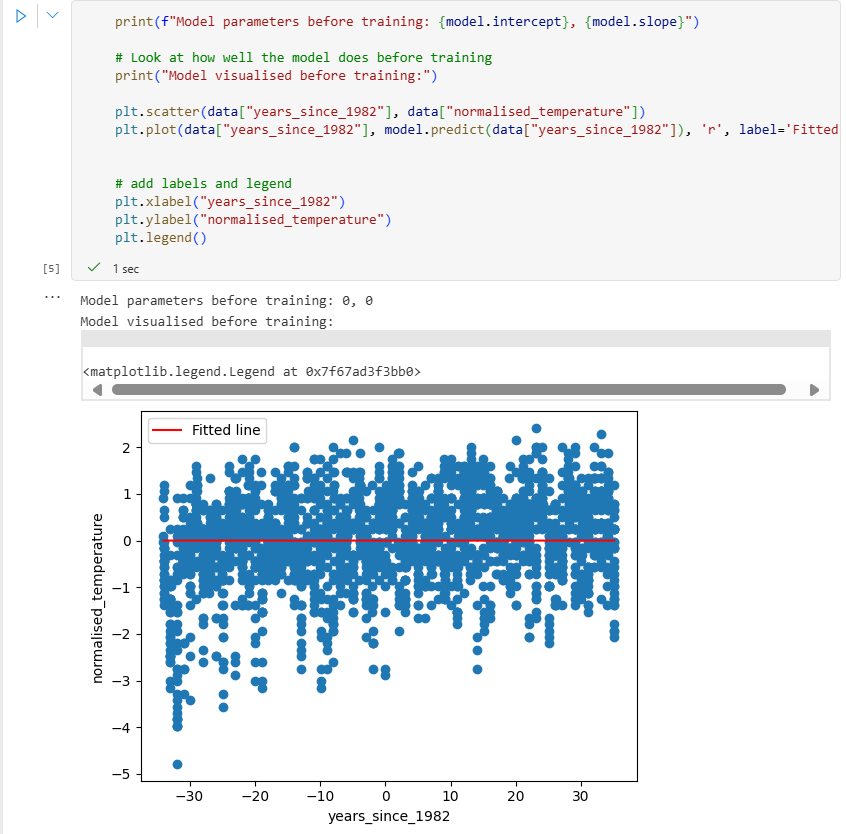
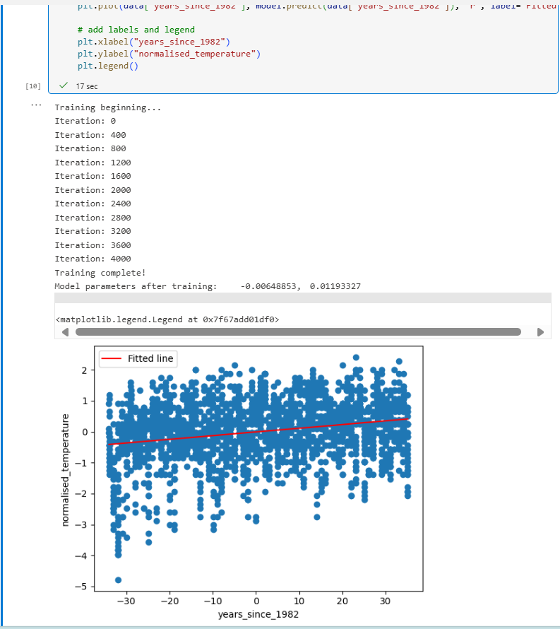
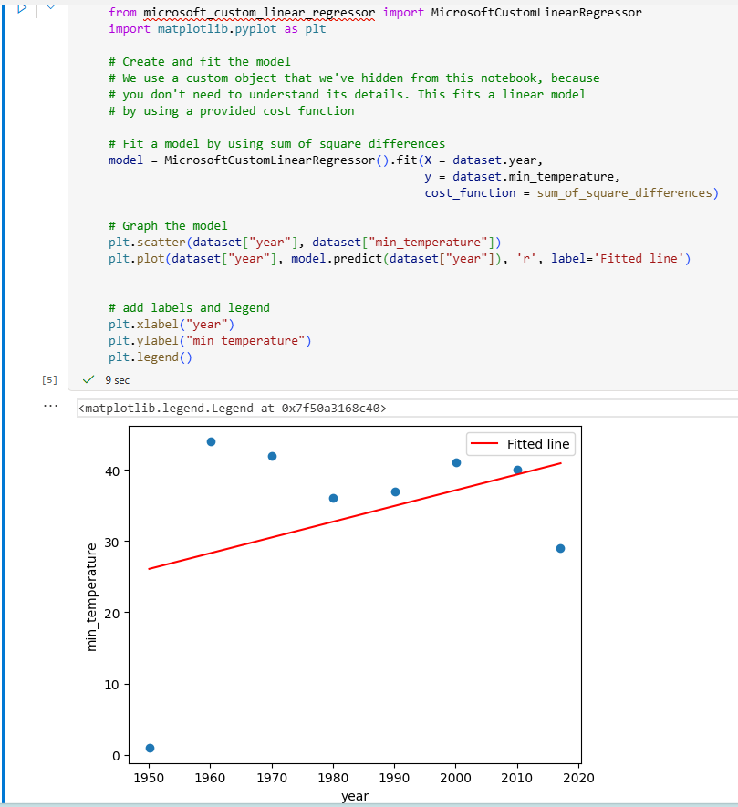
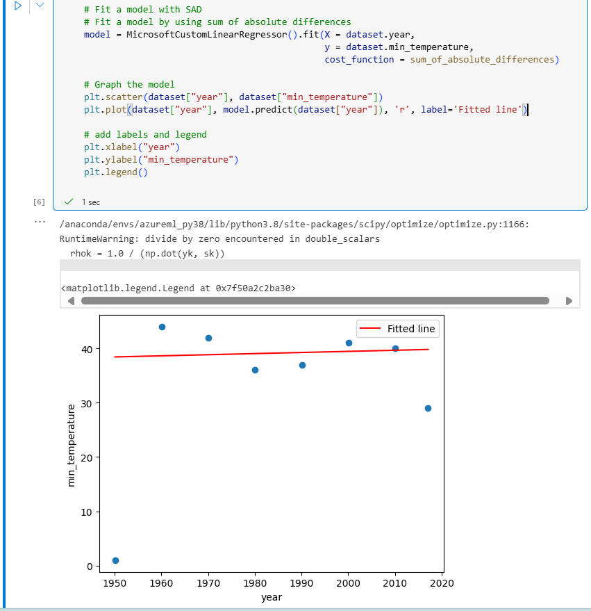
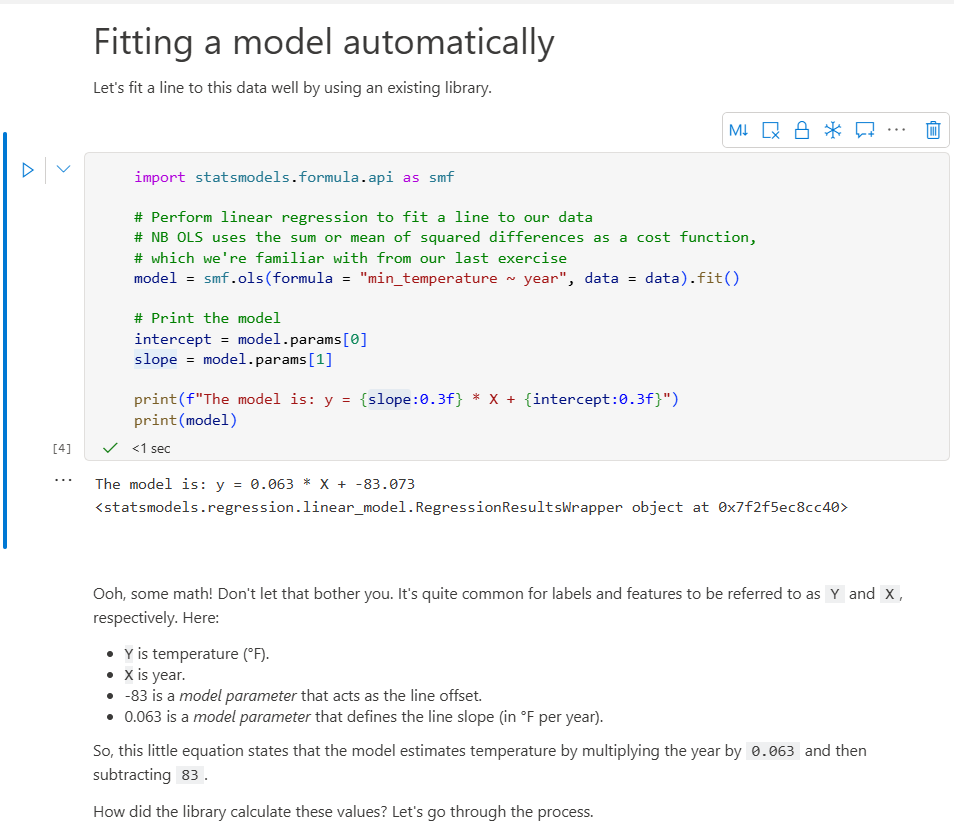
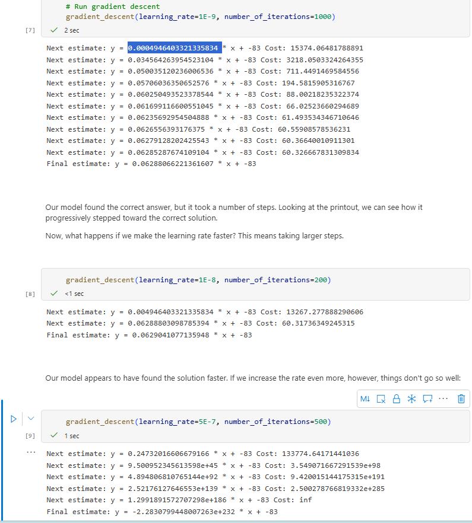

# classicsml ⛈️🔄📉
classicsml : Classsic Supervised ML # Cost Function # Gradient Descent

## Objective
- Implement supervised learning
- Minimized error with cost function
  - SSD (sum of squared differences)
  - SAD (sum of absolute differences)
- Optimized model using gradient descent
- Experiment with learning rates (how they affect training)

## Classical ML models with Supervised Learning

